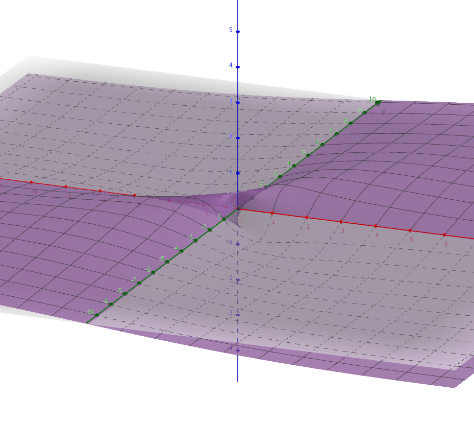
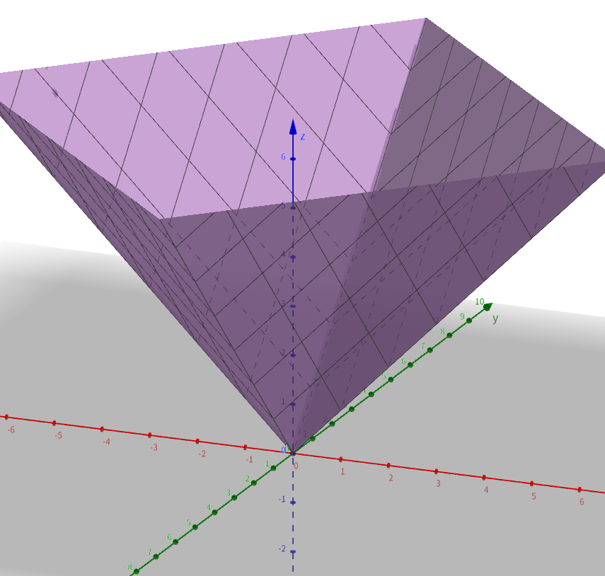
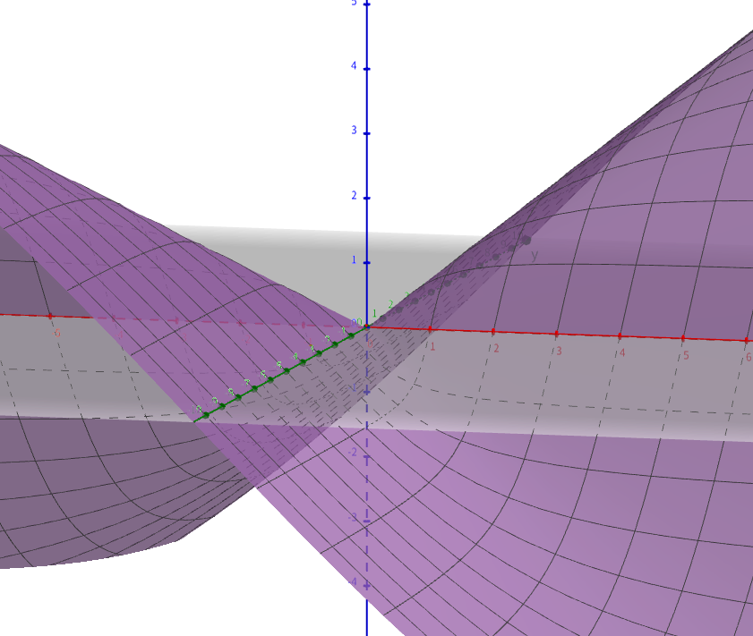
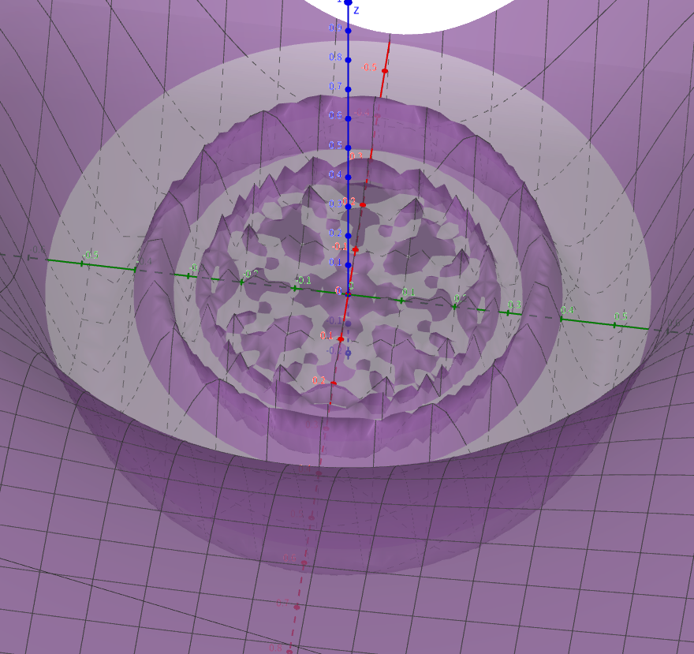

##  多元微分学易错概念辨析

## （一）证明偏导数存在（可偏导）、连续、可微、偏导数连续的方法

（1）可偏导：为证函数 $z=f(x, y)$ 在点 $\left(x_{0}, y_{0}\right)$ 处可偏导，即偏导数分别存在，即证两个极限

$$
\lim _{\Delta x \rightarrow 0} \frac{f\left(x_{0}+\Delta x, y_{0}\right)-f\left(x_{0}, y_{0}\right)}{\Delta x}, \lim _{\Delta y \rightarrow 0} \frac{f\left(x_{0}, y_{0}+\Delta y\right)-f\left(x_{0}, y_{0}\right)}{\Delta y}
$$

存在。
（2）连续：为证函数 $z=f(x, y)$ 在点 $\left(x_{0}, y_{0}\right)$ 处连续，即证 $\lim _{(x, y) \rightarrow\left(x_{0}, y_{0}\right)} f(x, y)=f\left(x_{0}, y_{0}\right)$ ．
（3）可微：为证函数 $z=f(x)$ 在点 $\left(x_{0}, y_{0}\right)$ 处可微，即证

$$
\begin{aligned}
& \lim _{\rho \rightarrow 0} \frac{\Delta z-\left[f_{x}^{\prime}\left(x_{0}, y_{0}\right) \Delta x+f_{y}^{\prime}\left(x_{0}, y_{0}\right) \Delta y\right]}{\rho} \\
& =\lim _{\rho \rightarrow 0} \frac{f\left(x_{0}+\Delta x, y_{0}+\Delta y\right)-f\left(x_{0}, y_{0}\right)-\left[f_{x}^{\prime}\left(x_{0}, y_{0}\right) \Delta x+f_{y}^{\prime}\left(x_{0}, y_{0}\right) \Delta y\right]}{\rho}
\end{aligned}
$$

是否为 0 ，若为 0 ，则可微，若不为 0 ，则不可微，其中 $\rho=\sqrt{(\Delta x)^{2}+(\Delta y)^{2}}$ ．
（4）偏导数连续：为证 $z=f(x, y)$ 在 $\left(x_{0}, y_{0}\right)$ 处偏导数连续，即证

$$
\lim _{\substack{x \rightarrow x_{0} \\ y \rightarrow y_{0}}} f_{x}^{\prime}(x, y)=f_{x}^{\prime}\left(x_{0}, y_{0}\right), \lim _{\substack{x \rightarrow x_{0} \\ y \rightarrow y_{0}}} f_{y}^{\prime}(x, y)=f_{y}^{\prime}\left(x_{0}, y_{0}\right)
$$

是否成立．若成立，则 $z=f(x, y)$ 在点 $\left(x_{0}, y_{0}\right)$ 处的偏导数是连续的．

## （二）偏导数存在、连续、可微、偏导数连续四者之间的关系

**（1）**$f(x, y)=\left\{\begin{array}{cl}\frac{x y}{x^{2}+y^{2}}, & (x, y) \neq(0,0) \\ 0, & (x, y)=(0,0)\end{array}\right.$ 在 $(0,0)$ 点**偏导数存在，但不连续**．

核心特征：在原点处不连续，像一个被撕裂并错位粘贴的面。
当沿着 x 轴（此时 y=0）或 y 轴（此时 x=0）走向原点时，函数值始终为 0。
但是，如果沿着直线 $y=x$ 走向原点，函数值恒为 $\frac{x^2}{x^2+x^2} = \frac{1}{2}$。
如果沿着直线 $y=-x$ 走向原点，函数值恒为 $\frac{-x^2}{x^2+x^2} = -\frac{1}{2}$。
所以，这个函数的曲面在原点处被“撕开”了。从不同方向靠近原点，你会到达不同的高度（0, 1/2, -1/2 等）。它没有一个确定的“落脚点”，因此在原点不连续。整个曲面看起来像是在原点处有无数条不同高度的“山脊”汇聚在一起。
**（2）**$f(x, y)=|x|+|y|$ 在 $(0,0)$ 点连续，但**偏导数不存在，也不可微**．

核心特征：在原点处连续，但不可微，像一个倒置的四棱锥。
图像描述：
这是一个非常规则的形状。它的顶点在原点 (0,0,0)。
从原点开始，曲面由四块平坦的平面组成，分别延伸到四个象限。
这些平面在 x 轴和 y 轴上相交，形成了尖锐的“棱”。
因为在原点以及坐标轴上有尖点和尖棱，所以无法在这些地方定义一个唯一的切平面，因此函数在原点不可微。但整个曲面是连在一起的，没有断开，所以在原点是连续的。
**（3）**$f(x, y)=\left\{\begin{array}{cl}\frac{x y}{\sqrt{x^{2}+y^{2}}}, & (x, y) \neq(0,0) \\ 0, & (x, y)=(0,0)\end{array}\right.$ 在 $(0,0)$ 点**连续且偏导数存在，但不可微**．

核心特征：在原点处连续且偏导存在，但不可微，像一个被“扭曲”的锥面。
图像描述：
这个函数在原点是连续的（可以用夹逼定理证明，其绝对值小于等于 $\frac{1}{2}\sqrt{x^2+y^2}$）。
它的偏导数在原点也存在（都为0）。
但是，它在原点并不可微。图像在原点虽然是连接的，但它不是“平滑”的。它不像一个光滑的碗底，也不像（2）中那样的尖锥，而是像一个在原点被轻微扭曲和捏过的锥形。它在原点处没有一个唯一的切平面可以很好地近似它。你可以想象一个柔软的锥顶，你从侧面捏了一下，形成了一个复杂的“褶皱点”。
**（4）**$f(x, y)=\left\{\begin{array}{cl}\left(x^{2}+y^{2}\right) \sin \frac{1}{x^{2}+y^{2}}, & (x, y) \neq(0,0) \\ 0, & (x, y)=(0,0)\end{array}\right.$ 在 $(0,0)$ 点**可微，但偏导数不连续**．

核心特征：在原点处可微，但偏导数不连续，像一个在中心剧烈振荡但最终被压平的曲面。
图像描述：
这是一个旋转对称的函数。它的形状只与到原点的距离 $r = \sqrt{x^2+y^2}$ 有关。
当 $(x,y)$ 远离原点时，函数图像看起来像一个平缓的碗。
当 $(x,y)$ 趋向于原点时，$\sin$ 项开始剧烈振荡，导致曲面在上下两个抛物面之间来回快速波动，形成无数圈涟漪。
尽管振荡得非常快，但由于振幅被 $(x^2+y^2)$ 控制，所以当靠近原点时，这些涟漪的幅度被迅速“压”向 0。
最终，在原点处，曲面被完美地“压平”，其切平面就是 $z=0$。因此它在原点是可微的。但是它的偏导数在原点附近持续剧烈振荡，没有极限，所以偏导数在原点不连续。

【例 1】（2002）考虑二元函数 $f(x, y)$ 在点 $\left(x_{0}, y_{0}\right)$ 的四条性质：
（1）$f(x, y)$ 在点 $\left(x_{0}, y_{0}\right)$ 处连续；（2）$f(x, y)$ 在点 $\left(x_{0}, y_{0}\right)$ 处的两个偏导数连续；
（3）$f(x, y)$ 在点 $\left(x_{0}, y_{0}\right)$ 处可微；（4）$f(x, y)$ 在点 $\left(x_{0}, y_{0}\right)$ 处的两个偏导数存在．则有（ ）。
A．$(2) \rightarrow(3) \rightarrow(1)$
B．$(3) \rightarrow(2) \rightarrow(1)$
C．$(3) \rightarrow(4) \rightarrow(1)$
D．$(3) \rightarrow(1) \rightarrow(4)$

【例 2】（李林 880）设 $f_{x}^{\prime}\left(x_{0}, y_{0}\right), f_{y}^{\prime}\left(x_{0}, y_{0}\right)$ 均存在，则下列选项正确的是（ ）。
A． $\lim _{\substack{x \rightarrow x_{0} \\ y \rightarrow y_{0}}} f(x, y)$ 存在
B．$f(x, y)$ 在 $\left(x_{0}, y_{0}\right)$ 处连续
C． $\lim _{x \rightarrow x_{0}} f\left(x, y_{0}\right)$ 存在
D．$f(x, y)$ 在 $\stackrel{\circ}{U}\left(x_{0}, y_{0}\right)$ 内有定义

【例 1 解析】 $f_{x}^{\prime}(x, y)$ 与 $f_{y}^{\prime}(x, y)$ 连续 $\Rightarrow f(x, y)$ 可微 $\Rightarrow\left\{\begin{array}{c}f_{x}^{\prime}(x, y) \text { 与 } f_{y}^{\prime}(x, y) \text { 存在 } \\ f(x, y) \text { 连续 }\end{array}\right.$ ，箭头的逆向不成立．选 A．
【例 2 解析】 $f(x, y)$ 在某点偏导数存在不一定在该点连续，也不能推得 $\lim _{\substack{x \rightarrow x_{0} \\ y \rightarrow y_{0}}} f(x, y)$ 存在，例如 $f(x, y)=\left\{\begin{array}{ll}\frac{x y}{x^{2}+y^{2}}, & (x, y) \neq(0,0), \\ 0, & (x, y)=(0,0),\end{array}\right.$ 可知 $f_{x}^{\prime}(0,0), f_{y}^{\prime}(0,0)$ 都存在，但 $\lim _{\substack{x=0 \\ y=0}} f(x, y)$ 不存在，故排除 A 和 B．

由 $f_{x}^{\prime}\left(x_{0}, y_{0}\right)=\lim _{x \rightarrow x_{0}} \frac{f\left(x, y_{0}\right)-f\left(x_{0}, y_{0}\right)}{x-x_{0}}$ 存在，只能推得当固定 $y=y_{0}$ 时，$f(x, y)$ 在 $x_{0}$ 的邻域内有定义．选项 D 反例：$f(x, y)=\left\{\begin{array}{cc}\frac{x y}{x^{2}-y^{2}}, & (x, y) \neq(0,0) \\ 0, & (x, y)=(0,0)\end{array}\right.$ ．但由 $f_{x}^{\prime}\left(x_{0}, y_{0}\right)=\lim _{x \rightarrow x_{0}} \frac{f\left(x, y_{0}\right)-f\left(x_{0}, y_{0}\right)}{x-x_{0}}$ 存在，可知 $\lim _{x \rightarrow x_{0}} f\left(x, y_{0}\right)=f\left(x_{0}, y_{0}\right), \mathrm{C}$ 正确．

